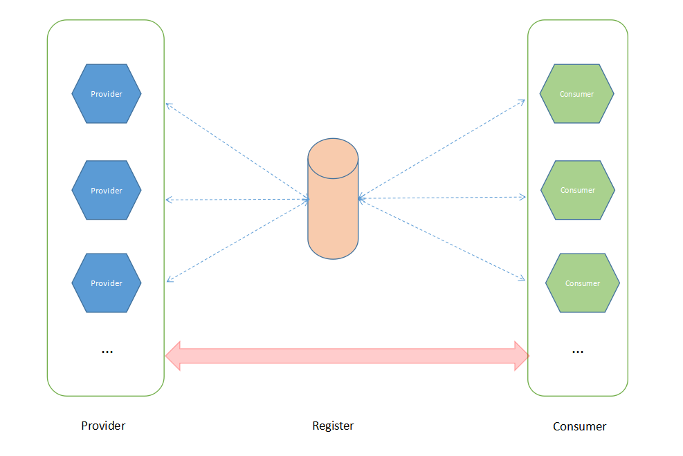

# mrpc
mrpc 是一个java语言分布式服务框架,旨在快速开发高可用的分布式服务/消费
# mrpc 目前特性
* 简单高效的rpc调用实现
* 服务动态注册和发现，支持zookeeper、redis
* 服务负载均衡（随机调用）
* 服务调用超时重连
* 服务不可用重试其他服务提供者


# 开始

## 安装

使用git下载或者下载zip编译安装

* git clone

```
git clone https://github.com/pretent/mrpc.git
cd mrpc
maven clean install
```

* 下载zip

```
unzip master.zip
cd master
maven clean install
```

## 添加maven 依赖
```
<dependency>
	<groupId>org.pretent.open</groupId>
	<artifactId>mrpc-core</artifactId>
	<version>0.0.1-SNAPSHOT</version>
</dependency>
```

## 注册中心
需要本地安装zookeeper或者redis，服务注册和发现默认使用zookeeper 127.0.0.1:2181

## 服务注册
#### 定义接口
```
import org.pretent.mrpc.Remote;
public interface UserService extends Remote {
    String say(String name) throws Exception;
}
```
服务接口须实现 org.pretent.mrpc.Remote接口
###服务发布
```
public static void main(String[] args) throws Exception {
		Provider provider = new MinaProvider();
		provider.publish("server.impl");
		provider.start();
}
```
### 将服务接口共享给客户端
消费端需要引入业务接口（UserService）
## 消费者服务调用
### 使用MRPCFactory.getInstance()取得服务代理
```
public static void main(String[] args) throws Exception {
	UserService service = ProxyFactory.getService(UserService.class);
	System.out.println("-->" + user.say("test"));
}
```
## 配置

需要添加/mrpc.properties

### 配置服务注册和发现中心（暂时支持zookeeper和redis）
```
register=zookeeper://127.0.0.1:2181 或者
register=redis://127.0.0.1:6379
```

### 配置调用服务超时时间(毫秒单位)
```
consumer.timeout=15000
```

### 配置服务默认端口
```
prot=51000
```

# 架构



# 更新日志

* 2016年12月09日13:59:01 新增支持redis注册中心
* 2016年12月08日15:56:08 支持根据包扫描发布服务
* 2016年12月08日12:50:56 新增架构图
* 2016年12月08日00:20:16 服务提供和消费支持MINA,默认为MINA
* 2016年12月06日14:12:33 新增支持zookeeper注册中心


感谢宁儿的大力支持和无私奉献
欢迎共同进步

E-Mail:353115817@qq.com

Blog:http://blog.csdn.net/pretent